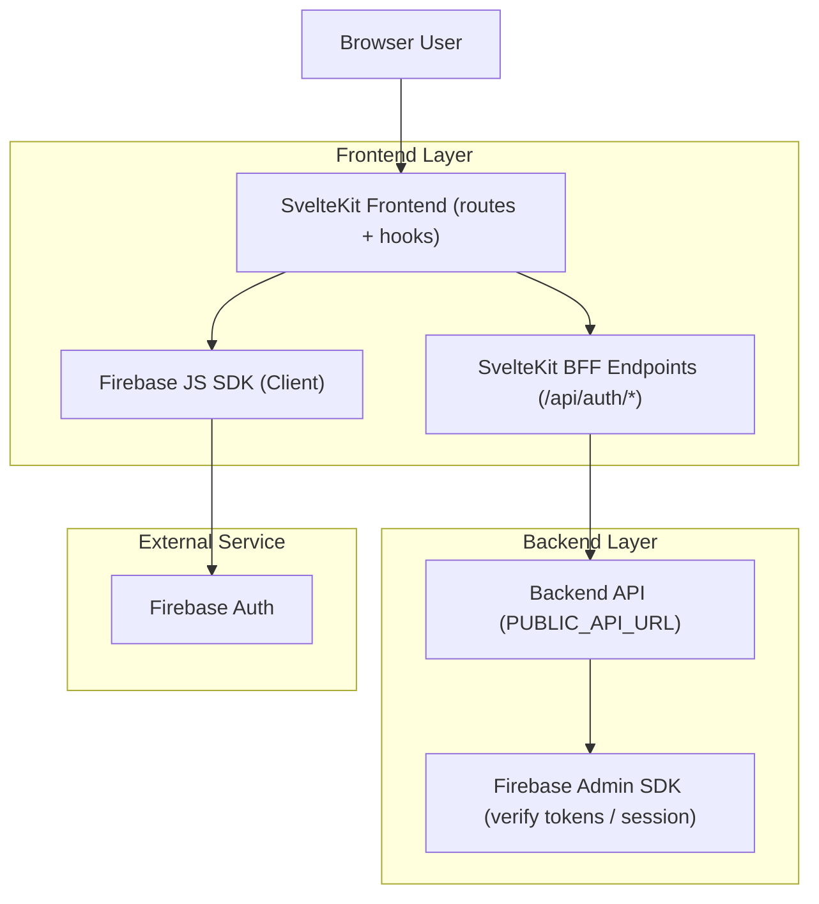
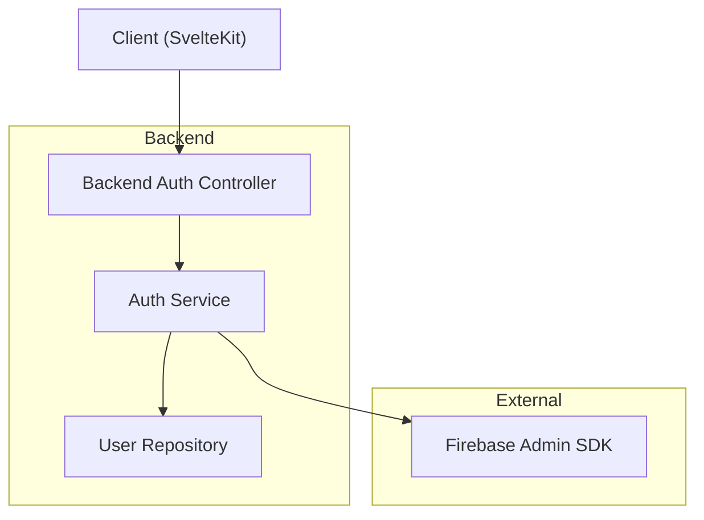

## 1.Architecture design

## 2.Technology Description

* Frontend: SvelteKit (Svelte) + fetch + svelte/store

* Auth Client: Firebase JS SDK (firebase/auth)

* Backend: REST API (PUBLIC\_API\_URL) + Firebase Admin SDK (wajib untuk verifikasi token & pembuatan session)

## 3.Route definitions

| Route             | Purpose                                                                                       |
| ----------------- | --------------------------------------------------------------------------------------------- |
| /auth/login       | Halaman login (email/password & social), kirim ID token ke server untuk membuat session       |
| /api/auth/session | BFF: terima {idToken} dari browser, minta backend membuat session, set cookie httpOnly        |
| /api/auth/refresh | BFF: terima {idToken} terbaru, rotasi/extend session cookie; dipanggil dari token\_refresh.ts |
| /admin/\*         | Area admin, butuh locals.user + role admin (lihat hooks.server.ts)                            |
| /user/account     | Area user biasa                                                                               |

## 4.API definitions (kontrak yang harus konsisten)

### 4.1 Prinsip token & session (berdasarkan implementasi saat ini)

* Browser **tidak menyimpan access token di localStorage**; session untuk request server harus lewat **cookie httpOnly** (lihat locals.session di hooks.server.ts).

* `ApiClientHandler` akan mengirim header `Authorization: Bearer ${access_token}` bila cookie `access_token` ada (lihat api\_helpers.ts). Maka nilai `access_token` **harus token yang valid untuk backend**, bukan `firebase_uid`.

* `FirebaseClientHelper.getIdToken()` sudah punya logika pre-refresh \~5 menit sebelum expiry (firebase\_client.ts). `token_refresh.ts` memaksa refresh dan memanggil `/api/auth/refresh`.

### 4.2 Endpoint yang disepakati

#### A) SvelteKit BFF: POST /api/auth/session

Tujuan: membuat session server-side setelah login sukses di Firebase client.

* Request (JSON): `{ idToken: string }`

* Proses:

  * Validasi `idToken` non-empty.

  * Forward ke backend: `POST {PUBLIC_API_URL}/auth/login` (atau endpoint ekuivalen).

  * Backend **mengembalikan**:

    * Opsi 1 (disarankan): Set-Cookie session (httpOnly) langsung dari backend, lalu BFF meneruskan/men-set ulang cookie.

    * Opsi 2: Body berisi `{ access_token, refresh_token?, user }`, lalu BFF set cookie.

* Response: 200 bila cookie sudah terset.

#### B) SvelteKit BFF: PUT /api/auth/refresh

Tujuan: rotasi/extend session cookie saat ID token baru diterbitkan.

* Request (JSON): `{ idToken: string }` (sesuai token\_refresh.ts)

* Proses:

  * Verifikasi `idToken` di backend (Firebase Admin) dan buat session cookie baru / extend expiry.

  * Set cookie `access_token` baru (dan `refresh_token` bila dipakai).

* Response:

  * 200 OK: session diperbarui.

  * 401: paksa logout di client (token\_refresh.ts sudah mengarahkan ke `/auth/login?session=expired`).

#### C) Backend: POST /auth/login

Tujuan: menukar Firebase ID token menjadi session backend.

* Request: `{ idToken: string }`

* Backend wajib:

  * `verifyIdToken(idToken, checkRevoked=true)`.

  * Menentukan role/permissions dari **custom claims** ATAU mapping internal user.

  * Mengembalikan `user` untuk dipakai di `hooks.server.ts` (via `deps.userService.CurrentUser()`).

### 4.3 MFA (Multi-Factor)

* Frontend sudah menyiapkan helper enroll & sign-in MFA berbasis SMS + reCAPTCHA invisible (firebase\_mfa.ts).

* Kontrak:

  * Jika login Firebase menghasilkan error `auth/multi-factor-auth-required`, UI login harus:

    1. buat `MultiFactorResolver` dari error,
    2. kirim OTP via `sendSignInVerificationCode(resolver)`,
    3. verifikasi via `completeSignIn(resolver, code)`,
    4. setelah berhasil -> panggil `POST /api/auth/session` dengan `idToken` terbaru.

* Backend tidak menangani OTP, tapi **harus menerima ID token pasca-MFA** (seharusnya sudah memenuhi policy MFA).

### 4.4 Role / custom claims

* Frontend bisa membaca `getIdTokenResult().claims` (firebase\_client.ts) untuk optimisasi UI, namun **otorisasi final** tetap di backend.

* Backend menetapkan claims (mis. `role`, `level`, atau daftar permissions) dan memastikan endpoint sensitif memverifikasi claims.

* `hooks.server.ts` saat ini menentukan admin dari `locals.user.role` (name/level). Backend harus memastikan field ini konsisten.

### 4.5 Cookie/session standardisasi

Cookie yang dipakai (lihat hooks.server.ts + auth\_helper.ts):

* `access_token` (httpOnly): token session backend / Firebase session cookie (bukan uid).

* `refresh_token` (httpOnly, opsional): hanya jika backend memang mengeluarkan refresh token.

* `csrf_session_id` (cookie yang diatur backend, dipakai oleh api\_helpers.ts saat fetch CSRF token).

Atribut cookie minimal:

* httpOnly: true

* secure: true pada production (sudah ada di hooks.server.ts)

* sameSite: 'lax'

* path: '/'

* maxAge: default 7 hari; kalau `rememberMe=true` gunakan maxAge lebih panjang, kalau tidak gunakan sesi lebih pendek.

## 5.Server architecture diagram

## Catatan mismatch yang perlu disejajarkan (berdasarkan file saat ini)

* `src/routes/auth/login/+page.server.ts` menyetel `access_token = firebase_uid` bila UID cocok; ini harus diganti menjadi **session token/cookie** yang memang dipakai backend.

* `src/routes/api/auth/session/+server.ts` dan `src/routes/api/auth/social-login/+server.ts` masih kosong; minimal `/api/auth/session` dan `/api/auth/refresh` harus ada agar alur store +

